<H1>Power BI Notes</H1>

In this repo I will cover Power BI concepts which will include functions of Power Query, DAX Queries, Graphs, Charts, UI/UX, way of presentation and more.

<H2>Power Query</H2>

Power Query is a data connection and transformation tool in Power BI, Excel, and other Microsoft products that allows users to extract, transform, and load (ETL) data from various sources. 
It provides a user-friendly, no-code interface for cleaning and reshaping data before loading it into a data model.

<h4>Key Features</h4>
<ul>
  <li>
<b>Data Connectivity:</b> Connects to multiple data sources (Excel, SQL, APIs, etc).
</li>
  <li>
<b>Data Transformation:</b> Cleans and reshapes data (removing duplicates, merging tables, etc).
</li>
  <li>
Updates data automatically when sources change.
</li>
  <li>
M Language (M Code):</b> Uses a formula language for advanced data transformation.
</li>
</ul>

<H2>Data Connectors / Data Extraction</H2>

You can connect your data along with IBM server, Python, BigQuery, etc.
Here are some common examples

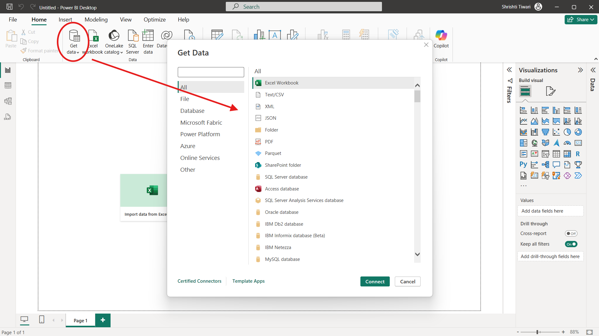

You can extract any datasets in power query using get data options, following it browsing your datasets from your respective folders.

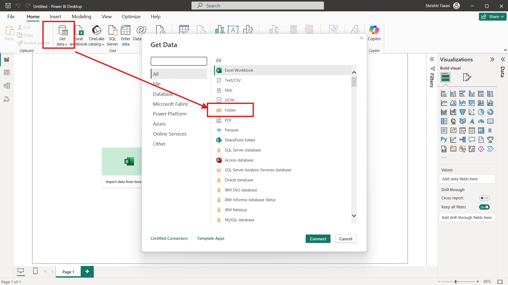
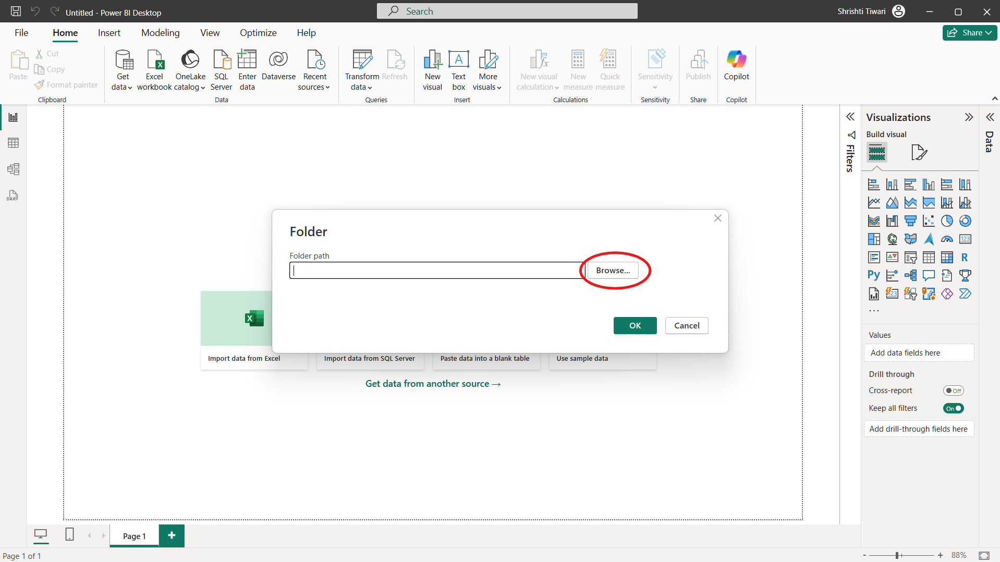
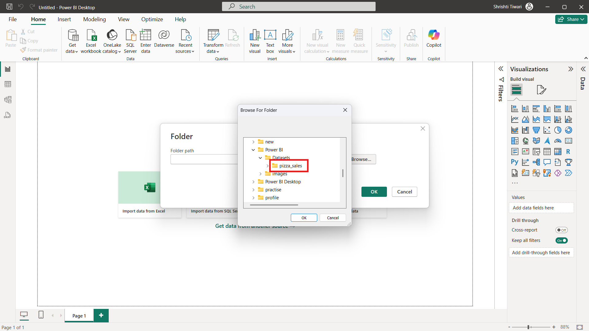

After which you will get the preview of your datasets and you need to click on transform data.

Once you will click on transform data, Power Query Editor will open in which you can transform your data and find hidden insights from your data.

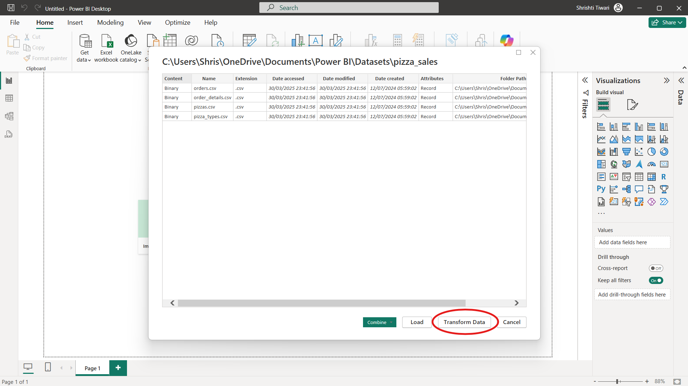

Now right click on Binary and select 'Add as New Query' in order to rename your dataset name.

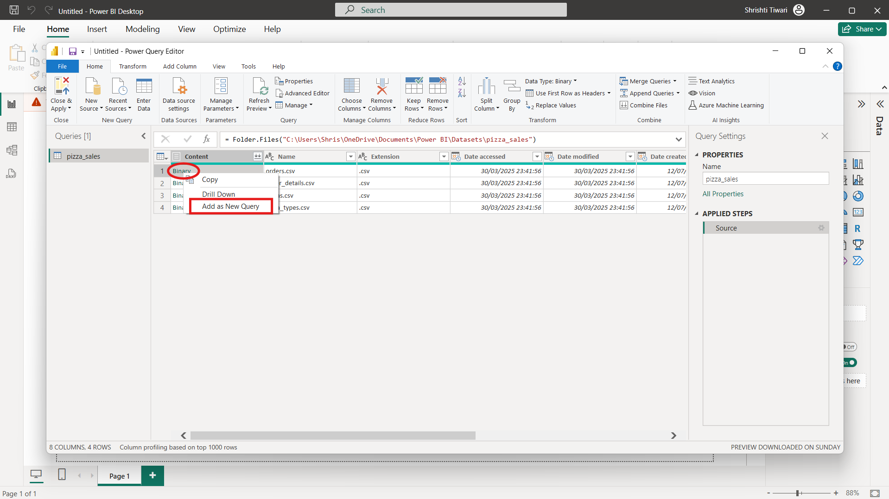

After this procedure you need to click on data file name.

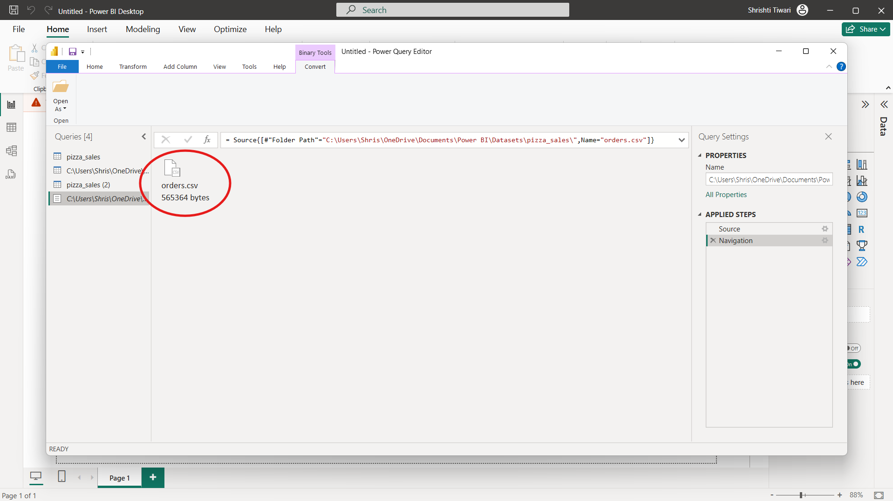

Now you can change the file name so that you can recognise your multiple data files name.

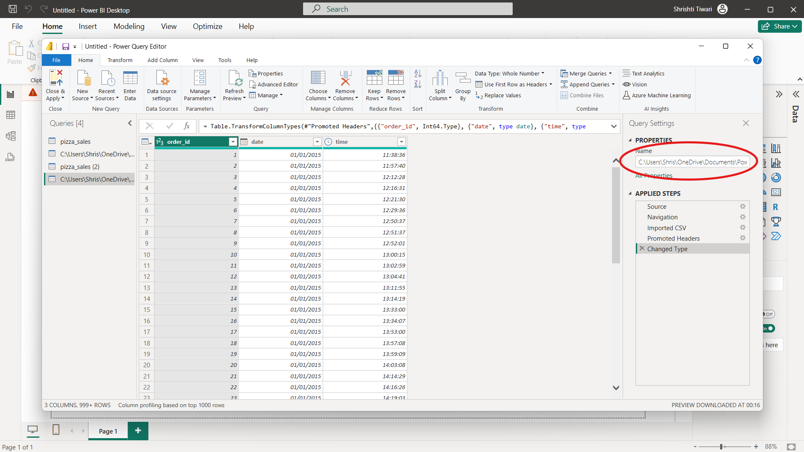

Similarly change all the data files names for proper format.

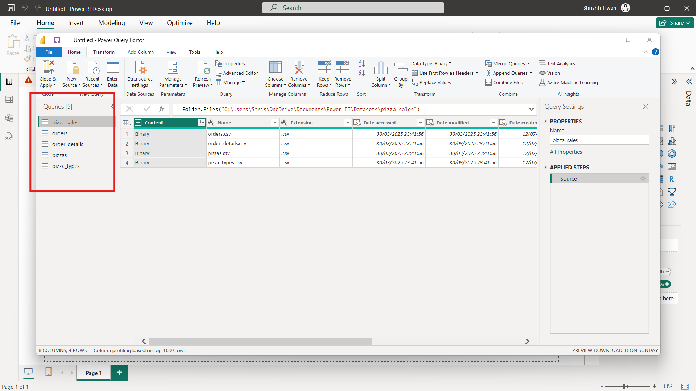

<h2>Basic Transformations</h2>

<h3>Setting Column</h3>

Now, as checked in pizza types data file, column names were wrongly set, thus we can change it by using (Use First Row as Headers) in Transform page.

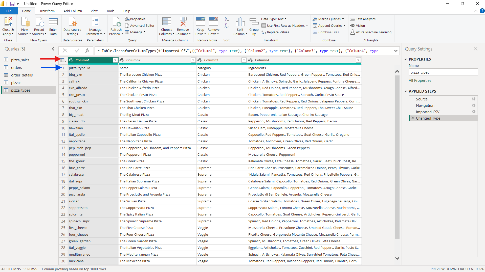

<h3>Dates</h3>

If suppose you want to extract month from the dates, you need to:
<ul>
<li>Add new column, you don't have to edit existing column</li>
<li>After that, click on Dates column and then select dates</li>
<li>And then you can select month and then name of the month in order to extract month.</li>
<li>After which you can notice we have extracted name of the month in new column.</li>

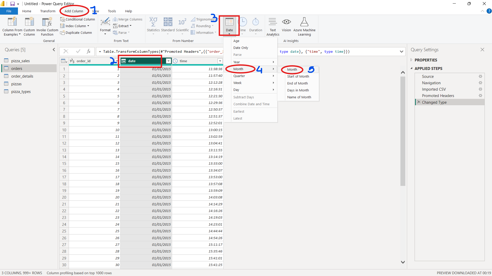
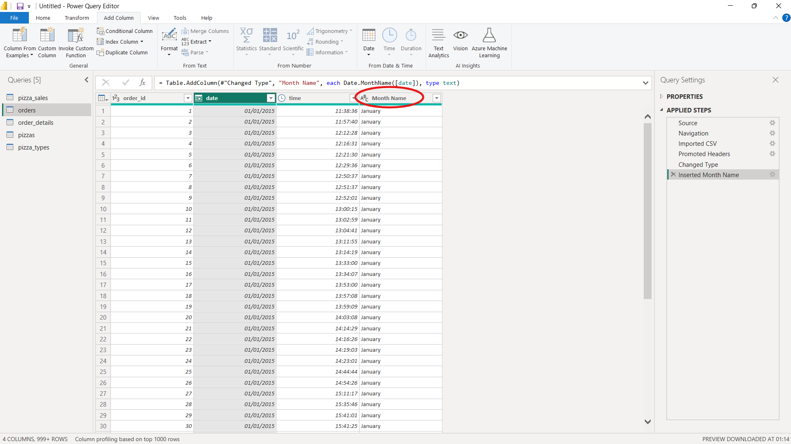

<h2>Text Tools</h2>
<h3>Merging two columns</h3>

If you want to merge any two columns then you have to select two colums, and after selecting it you need to select merge option from transform.

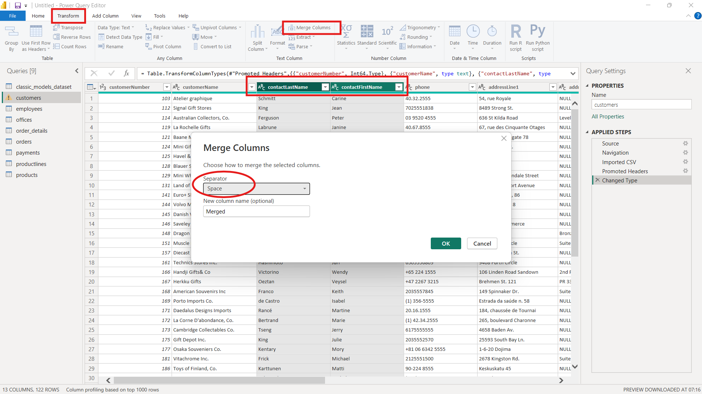

Once you have select merge, make sure you select space as seperator, or vice a versa.
After which you can see a column has been generated as merged, you just need to rename it according to your condition. I have renamed here it as Full Name.

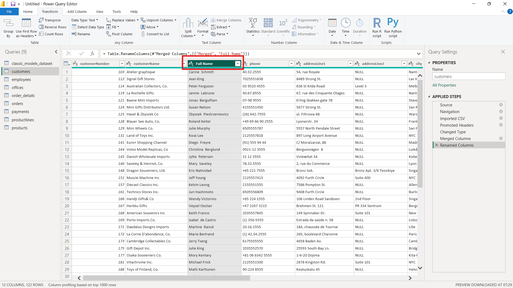

<h2>Extraction</h2>

Suppose we want to extract a username from email id in new column

First we will click on extract button and then we will select text before delimeter which we will take as @, since we want to extract username from email id, but suppose you want to extract domain from email id, then you must select text after delimeter.

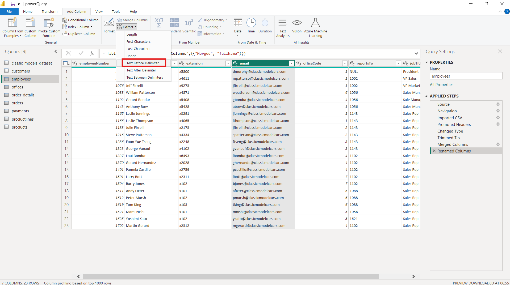
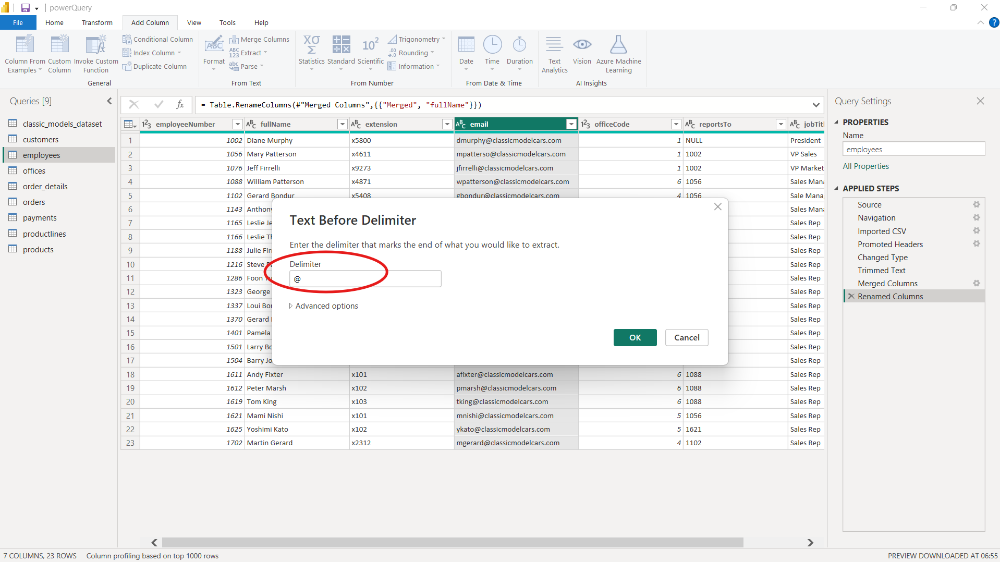
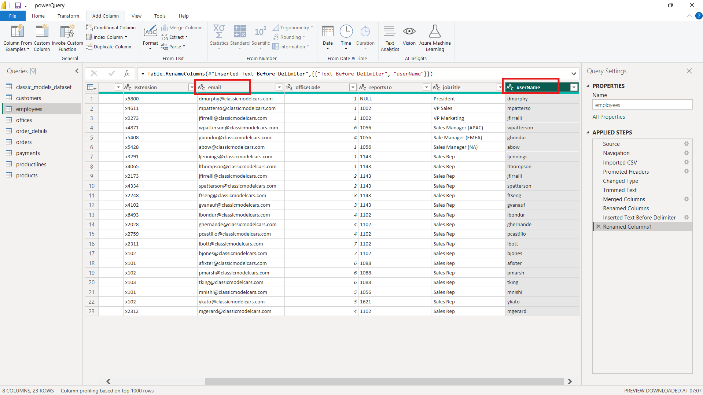
