<H1>Power BI Notes</H1>

In this repo I will cover Power BI concepts which will include functions of Power Query, DAX Queries, Graphs, Charts, UI/UX, way of presentation and more.

<H2>Power Query</H2>

Power Query is a data connection and transformation tool in Power BI, Excel, and other Microsoft products that allows users to extract, transform, and load (ETL) data from various sources. 
It provides a user-friendly, no-code interface for cleaning and reshaping data before loading it into a data model.

<h4>Key Features</h4>
<ul>
  <li>
<b>Data Connectivity:</b> Connects to multiple data sources (Excel, SQL, APIs, etc).
</li>
  <li>
<b>Data Transformation:</b> Cleans and reshapes data (removing duplicates, merging tables, etc).
</li>
  <li>
Updates data automatically when sources change.
</li>
  <li>
M Language (M Code):</b> Uses a formula language for advanced data transformation.
</li>
</ul>

<H2>Data Connectors / Data Extraction</H2>

You can connect your data along with IBM server, Python, BigQuery, etc.
Here are some common examples

You can extract any datasets in power query using get data options, following it browsing your datasets from your respective folders.

After which you will get the preview of your datasets and you need to click on transform data.

Once you will click on transform data, Power Query Editor will open in which you can transform your data and find hidden insights from your data.

Now right click on Binary and select 'Add as New Query' in order to rename your dataset name.

After this procedure you need to click on data file name.

Now you can change the file name so that you can recognise your multiple data files name.

Similarly change all the data files names for proper format.

<h2>Basic Transformations</h2>

<h3>Setting Column</h3>

Now, as checked in pizza types data file, column names were wrongly set, thus we can change it by using (Use First Row as Headers) in Transform page.

<h3>Dates</h3>

If suppose you want to extract month from the dates, you need to:
<ul>
<li>Add new column, you don't have to edit existing column</li>
<li>After that, click on Dates column and then select dates</li>
<li>And then you can select month and then name of the month in order to extract month.</li>
<li>After which you can notice we have extracted name of the month in new column.</li>

<h2>Text Tools</h2>
<h3>Merging two columns</h3>

If you want to merge any two columns then you have to select two colums, and after selecting it you need to select merge option from transform.

Once you have select merge, make sure you select space as seperator, or vice a versa.
After which you can see a column has been generated as merged, you just need to rename it according to your condition. I have renamed here it as Full Name.

<h3>Extraction</h3>

Suppose we want to extract a username from email id in new column

First we will click on extract button and then we will select text before delimeter which we will take as @, since we want to extract username from email id, but suppose you want to extract domain from email id, then you must select text after delimeter.

<h3>Removal of Null and Duplicate Values</h3>

For removal of null values there is option on tool bar which is replace values in which you call replace NULL as null which will show NULL values and it will be easy to remove them.

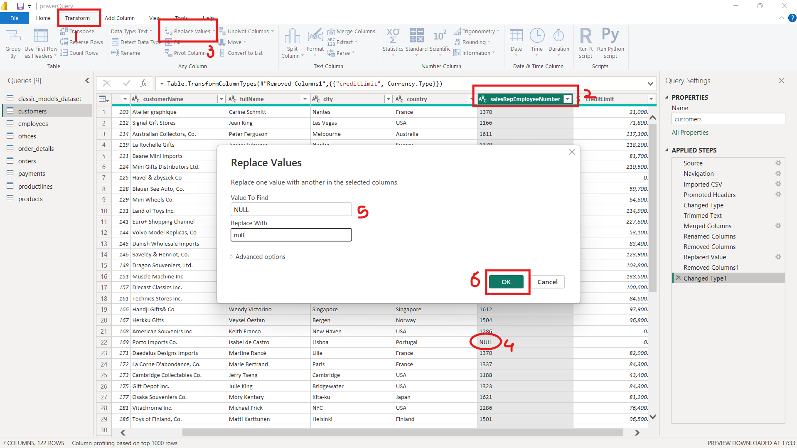
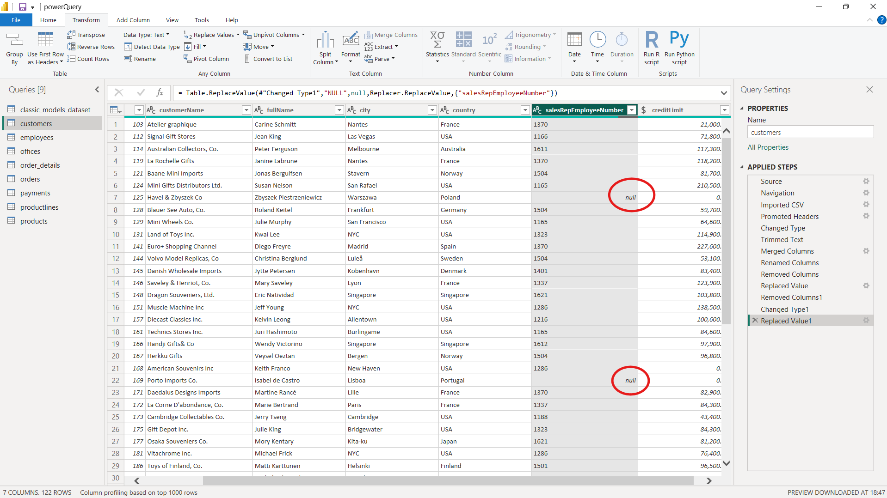

After which we can we can fill all these null values using fill down or fill up.

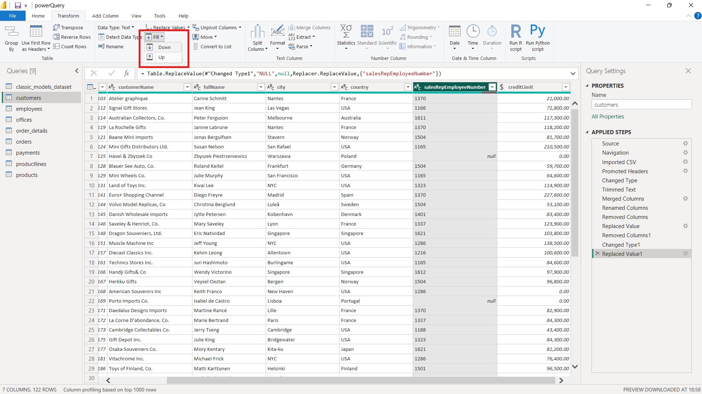

 And now you can see null values has been removed from data.

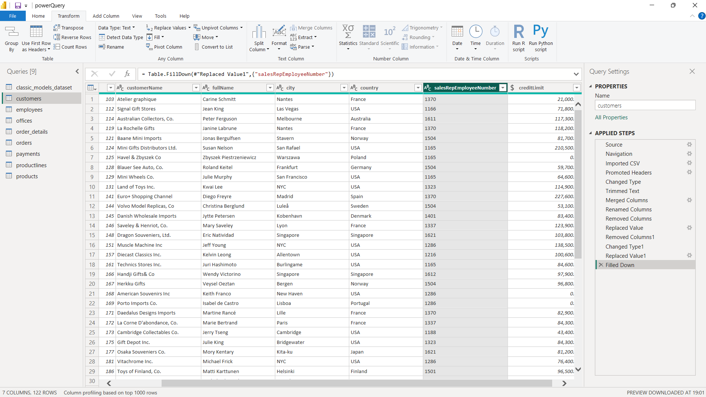

<h3>Removal of Duplicate Values</h3>

There is a option of removing duplicates in your row option when you right click on column name you wwill get option as Remove Duplicates which will help in removing duplicates from your rows

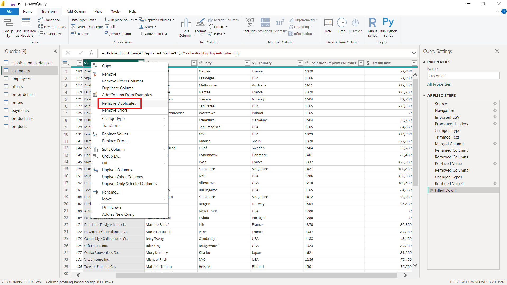

<h2>Numeric Tools Using PowerQuery</h2>

If we want to find any statistical values such as average, maximum or minimum we can use statistics given in option, but it will be better to use DAX queries in terms of finding statistical values.

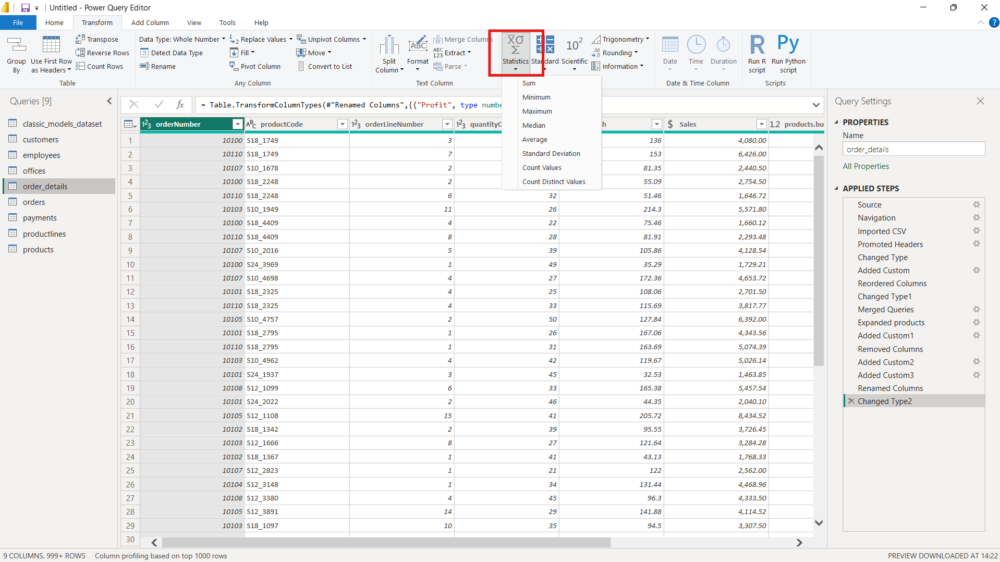

Q1: Find the total sales from the table order details

Ans: First we will add a new column i.e. add custom column, after which we will select two columns, first column which contains the number of product ordered, i.e. quantityOrdered and second we will select the column which contains price of each product, i.e. priceEach.

And After selection apply multiplication between both the columns in order to find the total sales.

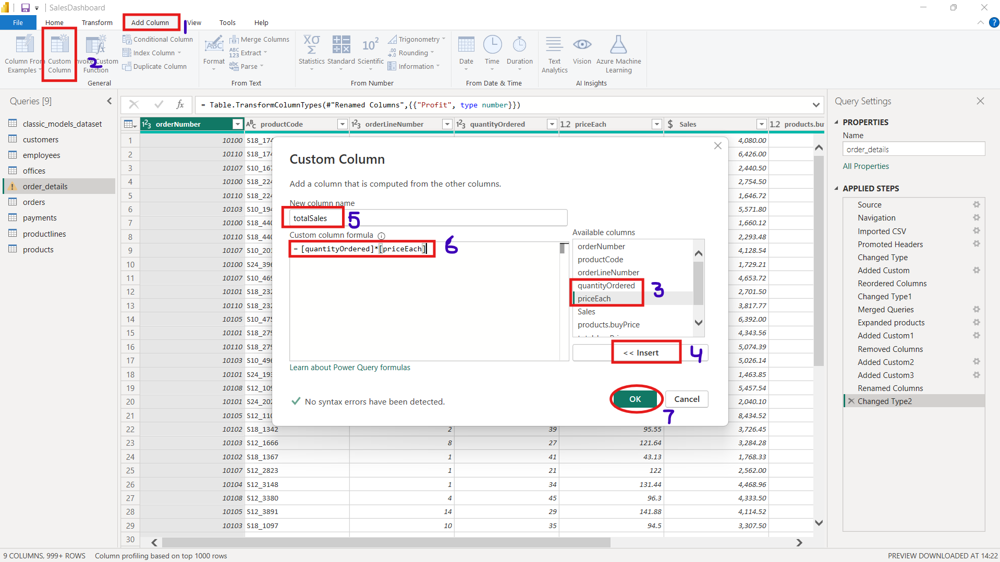

There are several other Mathematical functions such as Scientific calculations like Logarithmic, Exponential etc calculations, Trignometric calculations, Round up or Round down calculations, etc. You can explore each one to find out hidden insights from your data.

<h2>Date and Time</h2>

When anyone make orders, date and time are always recorded, and based on date and time we can find out insights, that on which month product was ordered mostly, on which month company had more profits, we can find hidden trends, which can help your business to grow in near future.

Q2: How can we remove NULL values from date and time column?

Ans: First change date column type in string format instead of date.

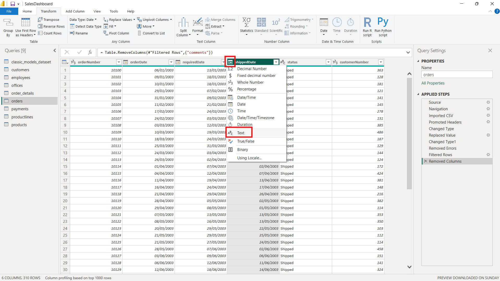

 Now you will be able to see NULL values, which you have to replace as 0 instead of null. It will start giving you error, but you need to remove your error rows as given in the picture.

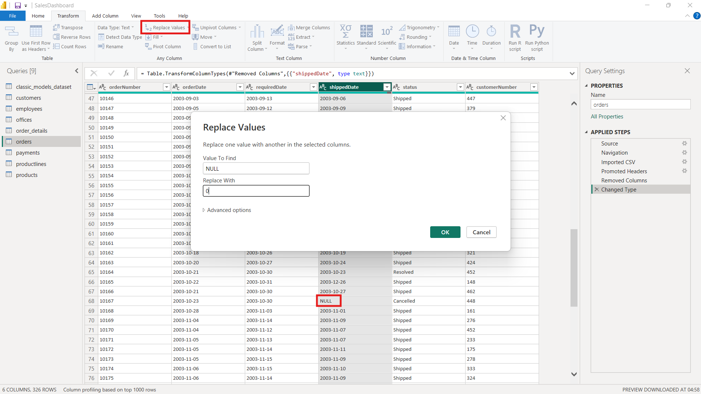

 Change the type again in Date format after which it will start giving error

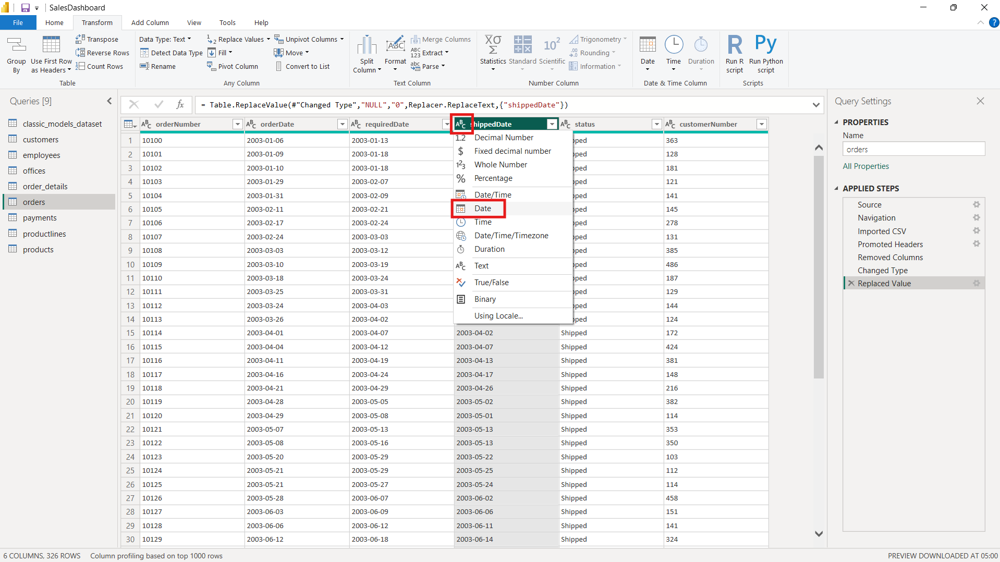
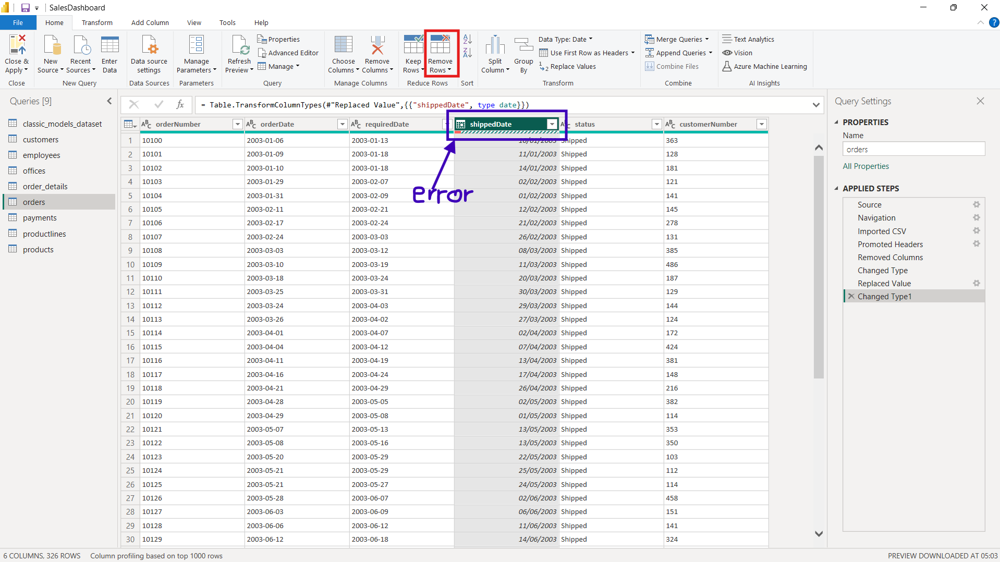

Now select remove error rows in order to remove error from that particular column after which your null values will be removed from Date column.

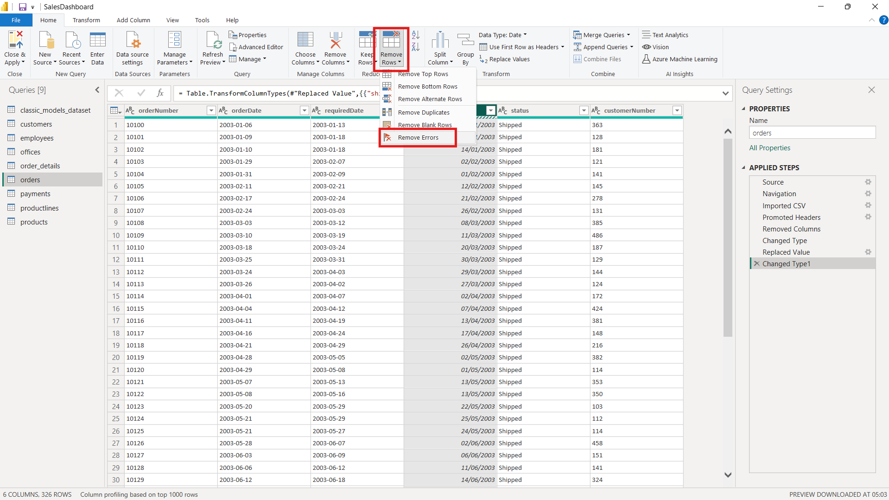

Q3: Extract the order month from the data

Ans: In order to extract month from orderDate column, we will select add column in task bar, and select date from tool bar, after which we can select name of the month, and extract it.

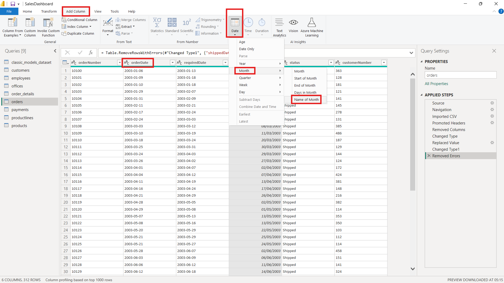
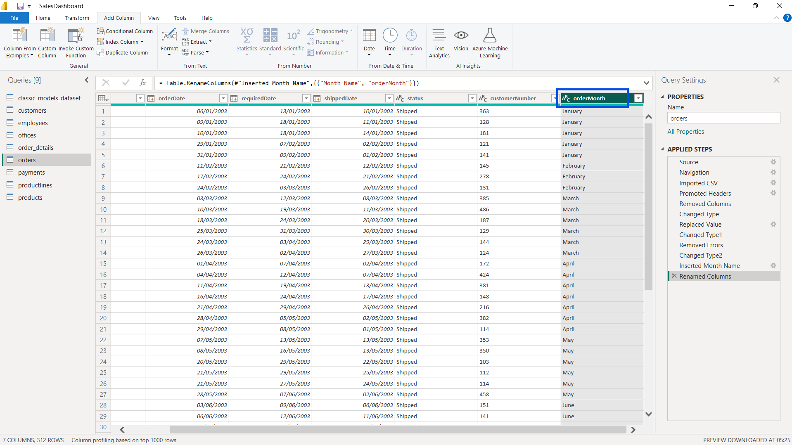

 Similarly we can select week and year
